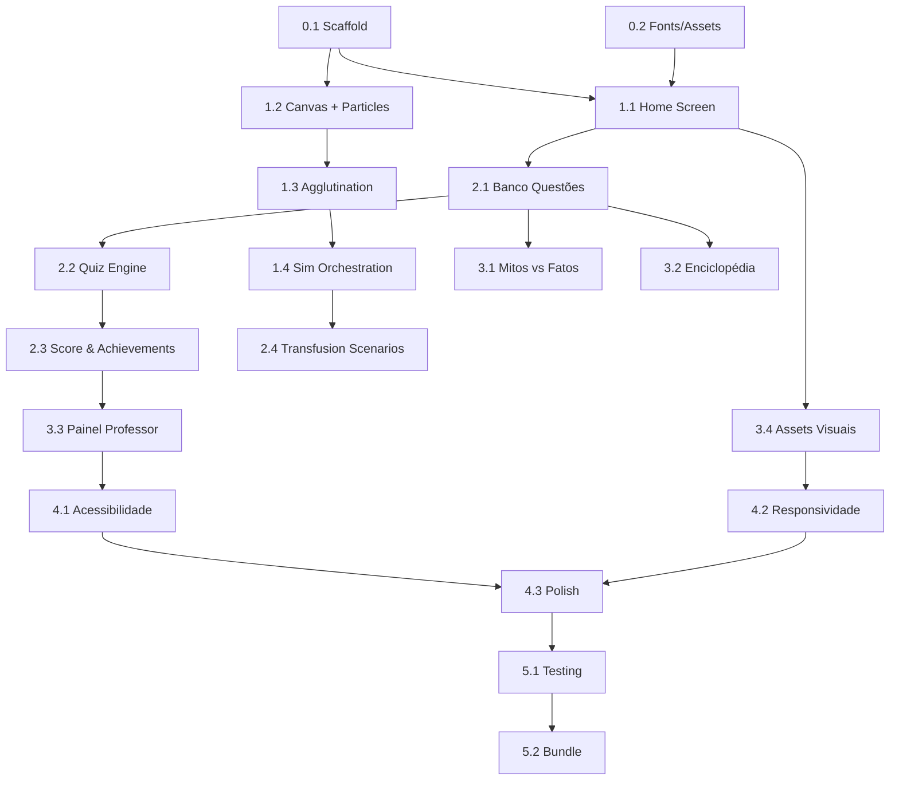

# 📅 Plano de Implementação — ABO Sim v1.0

## Timeline geral (10 dias úteis)

```
Fase 0: Setup          │▓▓│                                        (0.5 dia)
Fase 1: Core Engine    │  │▓▓▓▓▓▓▓▓│                               (3 dias)
Fase 2: Quiz & Game    │          │▓▓▓▓▓▓│                         (2.5 dias)
Fase 3: Conteúdo       │                │▓▓▓▓│                     (2 dias)
Fase 4: Polish         │                     │▓▓▓▓│                (1.5 dias)
Fase 5: QA & Deploy    │                          │▓▓│             (0.5 dia)
                       D1  D2  D3  D4  D5  D6  D7  D8  D9  D10
```

---

## Fase 0 — Setup do Projeto (0.5 dia)

### Task 0.1: Scaffold do projeto
**Agente:** `app-builder` (skill: `scaffolding.md`)
**Input:** Estrutura definida em `06_FILE_STRUCTURE.md`

**Ações:**
1. Criar a árvore de diretórios completa
2. Criar `index.html` com estrutura semântica base
3. Criar `css/variables.css` com todos os tokens do design system
4. Criar `css/reset.css` com CSS reset moderno
5. Criar `css/main.css` que importa módulos CSS
6. Criar `js/main.js` com entry point
7. Criar `js/core/event-bus.js` com implementação do Pub/Sub
8. Criar `js/core/router.js` com hash-based routing
9. Criar `js/core/storage.js` com abstração do LocalStorage
10. Criar `js/core/state-manager.js` com estado inicial

**Critério de conclusão:**
- `index.html` abre no navegador sem erros no console
- Navegação por hash funciona (#home mostra seção home)
- Event bus funciona (teste: emit → subscribe confirma)

---

### Task 0.2: Download de assets base
**Agente:** `frontend-specialist`

**Ações:**
1. Baixar fontes Inter e Outfit (woff2, subset latin)
2. Colocar em `fonts/`
3. Verificar que `@font-face` carrega corretamente

---

## Fase 1 — Core Engine (3 dias)

### Task 1.1: Home Screen (0.5 dia)
**Agente:** `frontend-specialist` (skills: `frontend-design`, `web-design-guidelines`)

**Ações:**
1. Implementar HTML da home (hero, feature cards, navbar)
2. Estilizar com CSS conforme `02_DESIGN_SYSTEM.md`
3. Adicionar animações de entrada (fadeIn)
4. Implementar navbar com toggle de tema e botão acessibilidade
5. Fazer responsivo (mobile-first)

**Critério de conclusão:**
- Tela visual conforme wireframe do design system
- Responsiva de 320px a 1920px
- Feature cards são clicáveis e navegam via router

---

### Task 1.2: Canvas Base + Particle System (1 dia)
**Agente:** `frontend-specialist` (skills: `game-development`)

**Ações:**
1. Implementar `js/simulation/animation-loop.js`
   - requestAnimationFrame loop
   - Delta time calculation
   - FPS counter (debug mode)
2. Implementar `js/simulation/particle.js`
   - Classe Particle com propriedades (x, y, vx, vy, radius, etc.)
   - Método `update(dt)` para movimento
   - Método `draw(ctx)` para renderizar
   - Colisão com paredes circulares do poço
3. Implementar `js/simulation/particle-system.js`
   - Pool de partículas (preallocated)
   - `spawn(count, wellBounds)` para criar partículas
   - `update(dt)` que itera todas as partículas
   - `draw(ctx)` que renderiza todas
4. Implementar `js/simulation/reagent-well.js`
   - Classe ReagentWell (tipo, posição, dimensões, canvas ref)
   - Estado: empty → filled → result
   - Método `addBlood(bloodType)` que trigger spawn

**Critério de conclusão:**
- 3 poços visíveis na tela (Canvas ou SVG containers)
- Partículas se movem com Brownian motion em cada poço
- 60fps em dispositivo médio (teste em DevTools Performance)
- Partículas colidem com as paredes do poço circular

---

### Task 1.3: Agglutination Logic (1 dia)
**Agente:** `frontend-specialist` (skills: `game-development`)

**Ações:**
1. Implementar `js/utils/blood-logic.js`
   - Tabela de compatibilidade antígeno-anticorpo
   - Função `shouldAgglutinate(bloodType, reagent) → boolean`
   - Dados dos 8 tipos: antígenos presentes, anticorpos no plasma
2. Implementar `js/simulation/agglutination.js`
   - Algoritmo de clustering baseado em forças de atração
   - `startClustering(particles)` → inicia força de atração
   - `updateClusters(dt)` → move partículas para centroides
   - Cluster estabiliza em 2-3 segundos
   - Visual: partículas em cluster ficam mais escuras e opacas
3. Integrar com `particle-system.js`:
   - Quando `shouldAgglutinate === true` → ativa clustering
   - Quando `false` → mantém Brownian motion

**Critério de conclusão:**
- Tipo A sangue em poço Anti-A → aglutina visualmente
- Tipo A sangue em poço Anti-B → NÃO aglutina
- Diferença visual clara entre aglutinação e não-aglutinação
- Transição gradual (não instantânea)
- Funciona corretamente para todos os 8 tipos

---

### Task 1.4: Simulation Orchestration (0.5 dia)
**Agente:** `frontend-specialist`

**Ações:**
1. Implementar `js/simulation/simulation-engine.js`
   - Orquestra o fluxo: selecionar tipo → pingar → observar → revelar
   - Gerencia estado: qual poço já foi preenchido
   - Detecta quando todos os 3 poços estão prontos
2. Implementar `js/screens/simulator-screen.js`
   - Layout da tela do simulador
   - Botões de interação (selecionar tipo, pingar, novo teste)
   - Info panel com status e explicação
3. Implementar 3 modos: Descoberta, Verificação, Desafio

**Critério de conclusão:**
- Fluxo completo funciona: clicar poço → gota cai → reação → resultado
- Os 3 modos são selecionáveis
- Resultado exibido com genótipos e explicação

---

## Fase 2 — Quiz & Gamificação (2.5 dias)

### Task 2.1: Banco de Questões (0.5 dia)
**Agente:** `deep-researcher` (skills: `research-synthesis`, `source-verification`)

**Ações:**
1. Criar `data/questions.json` com 30+ perguntas
2. Cada pergunta com: enunciado, tipo, alternativas, resposta correta, explicação, dificuldade, categoria
3. Validar precisão científica de cada pergunta e explicação
4. Incluir referências para as explicações

**Critério de conclusão:**
- 30+ perguntas distribuídas entre 5 categorias
- Todas com explicação científica validada
- JSON válido e bem estruturado

---

### Task 2.2: Quiz Engine (1 dia)
**Agente:** `frontend-specialist` (skills: `game-development`)

**Ações:**
1. Implementar `js/quiz/question-loader.js`
   - Carrega e embaralha questões do JSON
   - Filtra por categoria/dificuldade
   - Garante não repetir na mesma sessão
2. Implementar `js/quiz/quiz-engine.js`
   - Máquina de estados: idle → question → feedback → next → results
   - Timer por questão (30s default)
   - Cálculo de score com multiplicador streak
   - Persistência de histórico
3. Implementar `js/quiz/quiz-renderer.js`
   - Renderiza pergunta com alternativas
   - Animações de acerto (confetti) e erro (shake)
   - Barra de progresso
   - Tela de resultado final

**Critério de conclusão:**
- Quiz de 10 perguntas funciona end-to-end
- Timer funcional com visual feedback
- Feedback imediato com explicação
- Score calculado e persistido
- Animações de acerto/erro

---

### Task 2.3: Score Manager & Achievements (0.5 dia)
**Agente:** `frontend-specialist`

**Ações:**
1. Implementar `js/game/score-manager.js`
   - Score total acumulado, streak counter, multiplicador
2. Implementar `js/game/achievements.js`
   - 8 achievements conforme spec
   - Notificação toast ao desbloquear
3. Implementar `js/game/leaderboard.js`
   - Ranking local por apelido
   - Top 10 exibido em modal

---

### Task 2.4: Cenários de Transfusão (0.5 dia)
**Agente:** `frontend-specialist` + `deep-researcher`

**Ações:**
1. Criar `data/transfusion-scenarios.json` com 5-8 cenários
2. Implementar `js/screens/transfusion-screen.js`
   - Card de cenário com paciente, tipo, situação
   - Grid de opções de sangue para selecionar
   - Feedback: correto/incorreto com explicação clínica
3. Scoring: +15pts por cenário correto

---

## Fase 3 — Conteúdo & Extras (2 dias)

### Task 3.1: Mitos vs. Fatos (0.5 dia)
**Agente:** `deep-researcher` (skills: `source-verification`)

**Ações:**
1. Criar `data/myths.json` com 10 mitos/fatos
2. Implementar `js/screens/myths-screen.js`
   - Cards com afirmação, botões MITO/FATO
   - Reveal com explicação e referência
   - Animação flip-card

---

### Task 3.2: Enciclopédia (0.5 dia)
**Agente:** `deep-researcher` + `documentation-writer`

**Ações:**
1. Criar `data/encyclopedia.json` com 12 verbetes
2. Implementar `js/screens/encyclopedia-screen.js`
   - Lista lateral com verbetes
   - Área de conteúdo com texto, imagens SVG
   - Busca/filtro por texto

---

### Task 3.3: Painel do Professor (0.5 dia)
**Agente:** `frontend-specialist` (skills: `data-analysis`)

**Ações:**
1. Implementar `js/screens/teacher-screen.js`
   - Autenticação por PIN (hash no LocalStorage)
   - Dashboard com: total tipagens, distribuição de acertos, perguntas mais erradas
   - Gráficos simples (Canvas ou CSS-only charts)
   - Botão "Resetar turma"

---

### Task 3.4: Assets visuais (0.5 dia)
**Agente:** `frontend-specialist`

**Ações:**
1. Gerar ícones SVG para: hemácias, anticorpos, poços, gota de sangue, etc.
2. Criar favicon e Open Graph image
3. Otimizar SVGs (SVGO)
4. Criar OG tags para compartilhamento

---

## Fase 4 — Polish (1.5 dia)

### Task 4.1: Acessibilidade (0.5 dia)
**Agente:** `frontend-specialist` (skills: `web-design-guidelines`)

**Ações:**
1. Implementar `js/ui/accessibility.js`
   - Alto contraste toggle
   - Focus management (trap em modais)
   - Skip links
2. Adicionar ARIA labels em todos os interativos
3. Testar com teclado only
4. Validar contraste com Lighthouse

---

### Task 4.2: Responsividade final (0.5 dia)
**Agente:** `frontend-specialist` (skills: `responsive-design`)

**Ações:**
1. Testar em 320px, 375px, 768px, 1024px, 1440px
2. Corrigir breakpoints problemáticos
3. Validar touch targets (min 44x44px)
4. Testar orientação landscape em mobile

---

### Task 4.3: Micro-animações & polish (0.5 dia)
**Agente:** `frontend-specialist`

**Ações:**
1. Transições entre telas (fade/slide)
2. Hover effects em todos os botões/cards
3. Loading skeleton para carregamento
4. Smooth scroll para âncoras
5. Feedback tátil/visual para todas as interações

---

## Fase 5 — QA & Deploy (0.5 dia)

### Task 5.1: Testing
**Agente:** `test-engineer` (skills: `testing-patterns`)

**Ações:**
1. Teste manual de todos os fluxos (8 tipos × 3 modos)
2. Teste de quiz (30 perguntas)
3. Teste de cenários de transfusão
4. Teste em 3 navegadores (Chrome, Firefox, Safari/Edge)
5. Teste offline (desconectar rede → tudo funciona)
6. Lighthouse audit (Performance, Accessibility, SEO)

---

### Task 5.2: Bundle final
**Ações:**
1. Minificar CSS (se necessário)
2. Inline critical CSS no `<head>`
3. Gerar versão single-file (opcional) para distribuição fácil
4. Criar ZIP para download

---

## Dependências entre tasks



---

## Regra de ouro para a IA executora

> [!IMPORTANT]
> **Após concluir cada Task, a IA deve:**
> 1. Testar no navegador (se possível via browser tool)
> 2. Verificar console sem erros
> 3. Atualizar o status no arquivo `memoria/STATUS.md`
> 4. Commitar (se usando Git)
> 5. Só então seguir para a próxima task
