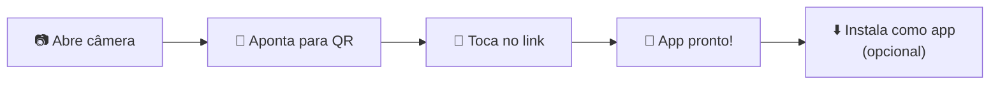
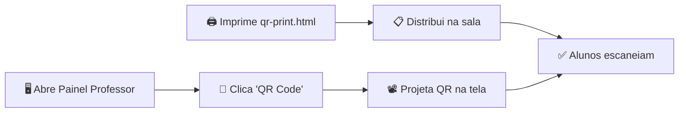

# 📋 Plano v2.6.0 — QR Code + Deploy Chromebook

Data: 2026-07-03  
Pasta alvo: `app-v-2-6-0/` (baseada na v2.5.0, com limpeza de segurança)

---

## Objetivo

Permitir que alunos em **Chromebook** leiam um **QR Code** (projetado, impresso ou na tela do professor) e o app **abra imediatamente no navegador**, pronto para uso, **sem nenhuma intervenção além de escanear**.

---

## Ciclo das 5 Personas Integradas

### 🏗️ Arquiteto — Desenho da Solução

**Estratégia escolhida**: **GitHub Pages** (custo zero, sem backend, sem manutenção).

| Alternativa avaliada | Motivo de aceitar/rejeitar |
|:---|:---|
| **GitHub Pages** ✅ | Repo já existe (`prifabiojorge/sistema-abo`), grátis, HTTPS automático, URL estável, funciona em Chromebook |
| Servidor local (professor) | Frágil: IP muda, precisa rodar a cada aula, Chromebooks podem estar em rede diferente |
| Firebase Hosting | Overengineering para app estático sem backend |
| Netlify / Vercel | Requer conta extra; GitHub Pages é nativo do repo existente |

**Arquitetura do deploy:**

```
Repositório GitHub: prifabiojorge/sistema-abo
│
├── docs/                     ← GitHub Pages serve daqui
│   ├── index.html
│   ├── manifest.json
│   ├── sw.js
│   ├── js/bundle.js
│   ├── css/...
│   ├── fonts/...
│   ├── img/...
│   │   ├── icons/...
│   │   └── qr-code.svg       ← QR Code estático
│   └── qr-print.html         ← Página impressível com QR Code
│
├── app-v-2-5-0/              ← Versão anterior (backup)
├── app-v-2-6-0/              ← Fonte da v2.6.0
└── memoria/                  ← Este documento
```

**URL final**: `https://prifabiojorge.github.io/sistema-abo/`

**Fluxo do aluno (2 passos)**:
1. 📷 Escaneia QR Code com câmera do Chromebook
2. 🖥️ App abre direto no Chrome, pronto para usar

---

### 🛡️ Guardião de Segurança — Análise de Riscos

> [!CAUTION]
> **ACHADO CRÍTICO**: O arquivo `chatbot-screen.js` com a chave API do Google AI Studio embutida (`AQ.Ab8RN6...`) ainda existe fisicamente em `app-v-2-5-0/js/screens/chatbot-screen.js` (24KB). Embora NÃO seja incluído no `bundle.js`, o arquivo estará acessível publicamente se copiado para `docs/`.

**Ações obrigatórias de segurança (ANTES do deploy):**

| # | Ação | Risco mitigado | Status |
|:---|:---|:---|:---|
| S1 | **Excluir** `chatbot-screen.js` de `app-v-2-6-0/js/screens/` | Vazamento de chave API pública | `[x]` |
| S2 | Varredura completa por `AIza`, `AQ.`, `api-key`, `sk-` em todos os arquivos de `docs/` | Segredos residuais | `[x]` |
| S3 | Garantir que `docs/` contenha APENAS os arquivos necessários (sem `.js` fonte, sem `.ps1`, sem `chatbot-*`) | Superfície de ataque mínima | `[x]` |
| S4 | Verificar `.gitignore` para não vazar `node_modules`, `.env` ou backups | Git hygiene | `[x]` |
| S5 | HTTPS é automático no GitHub Pages — verificar se `manifest.json` e `sw.js` usam caminhos relativos (`./`) | Mixed content block | `[x]` |

---

### 🔄 Orquestrador — Sequência de Execução

**Fase 0 — Preparação de segurança**
- `[x]` 0.1 Criar `app-v-2-6-0/` como cópia de `app-v-2-5-0/`
- `[x]` 0.2 **EXCLUIR** `chatbot-screen.js` de `app-v-2-6-0/js/screens/`
- `[x]` 0.3 Varredura de segredos: grep por `AQ.`, `AIza`, `api_key`, `sk-` em toda `app-v-2-6-0/`
- `[x]` 0.4 Atualizar metadados de versão para v2.6.0 (index.html, main.js, sw.js, manifest.json, keyboard.js, README.md, launchers)

**Fase 1 — Geração do QR Code**
- `[x]` 1.1 Definir URL final: `https://prifabiojorge.github.io/sistema-abo/`
- `[x]` 1.2 Gerar QR Code como SVG inline (usando biblioteca JS leve `qr-creator` embutida no bundle, ~3KB)
- `[x]` 1.3 Criar `qr-print.html` — página impressível (fundo branco, QR Code grande, instruções para alunos, URL legível como fallback)

**Fase 2 — Integração no App**
- `[x]` 2.1 Adicionar botão 📱 no **Painel do Professor** (aba "QR Code") que exibe o QR Code em tela cheia para projeção
- `[x]` 2.2 Adicionar atalho de teclado `Q` para o professor abrir o QR Code rapidamente
- `[x]` 2.3 Adicionar entrada no `search-palette.js` para "QR Code"
- `[x]` 2.4 O QR Code no app deve ser gerado dinamicamente via `canvas` + biblioteca leve, usando `window.location.origin + window.location.pathname` (funciona em qualquer URL onde o app estiver hospedado)

**Fase 3 — Otimização PWA para Chromebook**
- `[x]` 3.1 Atualizar `manifest.json`:
  - Adicionar `"id": "abo-pai-degua"` (identificador único PWA)
  - Adicionar `"scope": "./"` 
  - Adicionar `"prefer_related_applications": false`
- `[x]` 3.2 Atualizar `sw.js`:
  - Cache name: `abo-pai-degua-v2.6.0`
  - Adicionar `qr-print.html` à lista de cache
- `[x]` 3.3 Adicionar banner de instalação PWA: ao detectar `beforeinstallprompt`, exibir toast "Instalar ABO Pai d'égua no dispositivo?"
- `[x]` 3.4 Garantir que `start_url` funcione com GitHub Pages path

**Fase 4 — Montagem do `docs/` para GitHub Pages**
- `[x]` 4.1 Criar pasta `docs/` na raiz do repositório
- `[x]` 4.2 Copiar de `app-v-2-6-0/` para `docs/`:
  - `index.html`, `manifest.json`, `sw.js`
  - `js/bundle.js` (APENAS o bundle, não os fontes)
  - `css/` (todos os CSS)
  - `fonts/` (woff2)
  - `img/` (favicon, og-image, icons)
  - `qr-print.html`
- `[x]` 4.3 **NÃO copiar**: `js/screens/`, `js/build.ps1`, `chatbot-screen.js`, `ABRIR-*.cmd`, `ABRIR-*.html`, `README.md`
- `[x]` 4.4 Rebuild `bundle.js` e `node --check` final

**Fase 5 — Página impressível `qr-print.html`**
- `[x]` 5.1 Criar HTML com:
  - QR Code SVG grande (300×300px)
  - Título: "📱 Escaneie para abrir o ABO Pai d'égua"
  - URL legível embaixo do QR como fallback manual
  - Instruções: "Abra a câmera do Chromebook → Aponte para o QR Code → Toque no link"
  - Créditos: Prof. Fábio Fabuloso — CISEB 2026
  - CSS `@media print` otimizado (preto e branco, sem margens desnecessárias)
- `[x]` 5.2 Layout imprimível em A4, com versão 2× para recortar múltiplos QR Codes por folha

**Fase 6 — Commit, Push e Ativação do GitHub Pages**
- `[x]` 6.1 `git add docs/ memoria/ app-v-2-6-0/`
- `[x]` 6.2 `git commit -m "v2.6.0: QR Code + GitHub Pages deploy para Chromebook"`
- `[x]` 6.3 `git push origin main`
- `[ ]` 6.4 **Ação manual do professor**: No GitHub → Settings → Pages → Source: `main` → Folder: `/docs` → Save
  - Instruções passo a passo com screenshots serão fornecidas

**Fase 7 — Validação**
- `[x]` 7.1 `node --check docs/js/bundle.js` — sem erros
- `[x]` 7.2 Varredura de segurança final em `docs/`: `grep -rn "AQ\.\|AIza\|api.key\|sk-" docs/` → 0 resultados
- `[ ]` 7.3 Verificar que `https://prifabiojorge.github.io/sistema-abo/` carrega (após ativação do Pages)
- `[ ]` 7.4 Escanear QR Code com câmera do Chromebook e validar que abre direto
- `[ ]` 7.5 Verificar que o Service Worker cacheia tudo e o app funciona offline após primeiro carregamento

---

### 🧑‍🎓 Advogado do Usuário — Experiência do Aluno

**Jornada do aluno (Chromebook)**:



| Ponto de atrito eliminado | Como |
|:---|:---|
| Digitar URL longa | QR Code resolve para URL automaticamente |
| Instalar algo | App roda direto no Chrome, zero instalação |
| Configurar chave/conta | Não há chave API nem login |
| Funciona offline? | Sim, após primeiro acesso (Service Worker) |
| Tela pequena? | Layout já é responsivo (testado em 320px+) |

**Jornada do professor**:



**Extras para o professor**:
- Botão "Tela cheia" no modal do QR Code (para projetar com maxima visibilidade)
- Atalho `Q` para abrir QR Code instantaneamente
- `qr-print.html` pode ser aberto localmente e impresso mesmo sem internet

---

### 🤖 Agente do Harness — Checklist de Qualidade

| Regra | Verificação | Critério |
|:---|:---|:---|
| Build determinístico | `build.ps1` executa sem erros | Exit code 0 |
| Syntax válida | `node --check bundle.js` | Exit code 0 |
| Zero segredos | `grep -rn` para patterns de chaves | 0 resultados |
| QR Code funcional | SVG renderiza e codifica URL correta | Scan retorna URL |
| PWA instalável | Lighthouse PWA audit | Score ≥ 90 |
| Offline funcional | Desconectar rede após primeiro load | App responde |
| Chromebook compatível | Layout em 1366×768 | Sem overflow/scroll horizontal |

---

## Resumo: Segurança e UX desde a Arquitetura

> A segurança não foi um "patch final" — ela condicionou toda a estratégia de deploy:
> 
> 1. **Arquiteto** escolheu GitHub Pages (HTTPS automático) em vez de servidor local (HTTP inseguro).
> 2. **Guardião** identificou o `chatbot-screen.js` com chave API ANTES de qualquer cópia para `docs/`, bloqueando a Fase 4 até a Fase 0 estar verde.
> 3. **Orquestrador** sequenciou "limpeza → geração → integração → deploy" garantindo que nenhum arquivo contaminado chegue ao público.
> 4. **Advogado do Usuário** validou que a remoção do chatbot (já feita na v2.5.0) não impacta a experiência: o aluno nunca saberá que existiu.
> 5. **Harness** define critérios objetivos de aceitação (grep retorna 0, node --check passa, QR scan funciona) que bloqueiam o deploy se falharem.
>
> A UX foi projetada pelo princípio **"zero friction"**: escanear → usar. Sem conta, sem chave, sem instalação obrigatória. O professor tem duas opções para exibir o QR (projetar na tela ou imprimir) e o aluno tem uma única ação (escanear).

---

## Dependências e Pré-requisitos

- [ ] Professor deve ter acesso de admin ao repo `prifabiojorge/sistema-abo` no GitHub para ativar Pages
- [ ] Chromebooks dos alunos devem ter acesso à internet (apenas no primeiro uso; depois funciona offline)
- [ ] Câmera do Chromebook funcional (alternativa: digitar URL manualmente)

---

## Estimativa

| Fase | Tempo estimado |
|:---|:---|
| 0 — Segurança | ~5 min |
| 1 — QR Code | ~10 min |
| 2 — Integração no app | ~15 min |
| 3 — PWA Chromebook | ~5 min |
| 4 — Montagem docs/ | ~5 min |
| 5 — Página impressível | ~10 min |
| 6 — Git push | ~3 min |
| 7 — Validação | ~5 min |
| **Total** | **~58 min** |
